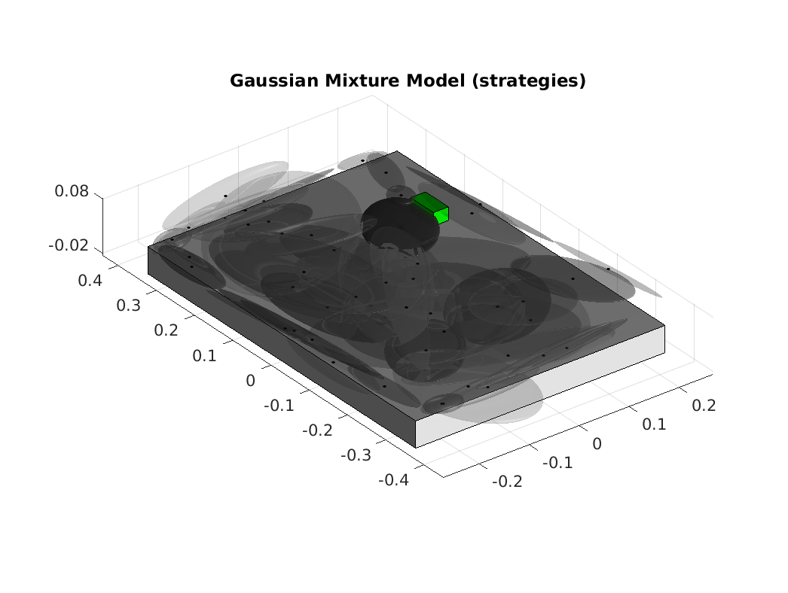

# gmm-learning-search-policies-pomdp
Parameters of GMM policy learned during search of a wooden green block on a table.

## Quick start

1. Clone the repository to your matlab workspace
2. In your matlab Command Window make sure the directory "gmm-learning-search-policies-pomdp" is present
3. Run the following:
```matlab
>>> addpath(genpath('./gmm-learning-search-policies-pomdp'))
```
4. Run the script PlotGMMTable.m (make sure you are outside the directory "gmm-learning-search-policies-pomdp")
5. You should see the following plot:

<p align="center">

</p>
